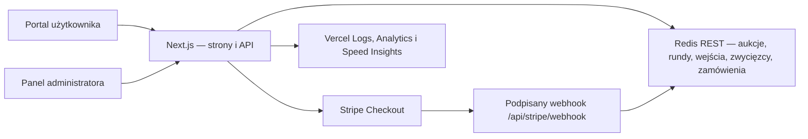

# Fiszy

Fiszy to portal aukcji ze spadającą ceną. Użytkownik opłaca wejście za 5 zł, obserwuje cenę malejącą w czasie i może spróbować kupić produkt jednym kliknięciem. Pierwszy poprawnie zapisany klik wygrywa; cena widoczna w chwili kliknięcia zostaje zamrożona dla zwycięzcy.

Repozytorium: `jryba94-maker/fiszy-mvp`

Technologia: Next.js 15 (App Router), React 19, TypeScript, Redis REST, Stripe Checkout i Vercel.

> To jest rozbudowane MVP przygotowane do dalszego rozwoju, a nie jeszcze kompletny system sprzedażowy. Wdrożenie na Production wymaga spełnienia wszystkich warunków opisanych w sekcji [Bramki Production](#bramki-production).

## Co działa

- publiczny katalog wielu aukcji;
- osobna strona każdej aukcji z zegarem, bieżącą ceną i stanami `waiting`, `live`, `payment_pending`, `sold` oraz `ended`;
- płatne wejście przez Stripe Checkout;
- atomowy wybór jednego zwycięzcy, również przy niemal równoczesnych kliknięciach;
- weryfikacja, że cena przesłana przez kupującego jest nadal aktualną ceną serwera;
- osobna płatność zwycięzcy za produkt i zebranie danych dostawy;
- idempotentny zapis opłaconego zamówienia po podpisanym webhooku Stripe;
- lokalna historia użytkownika pod `/moje-fiszy`;
- panel `/admin`: logowanie, wskaźniki, filtrowanie aukcji, tworzenie, edycja, planowanie kolejnych rund, zamówienia i diagnostyka;
- zgodność ze starszymi trasami jednej aukcji podczas migracji MVP;
- Vercel Analytics, Speed Insights, publiczny health check i strukturalne logi serwera.

## Architektura



Najważniejsze elementy modelu:

- `AuctionRecord` przechowuje tożsamość aukcji, produkt, stan publikacji i numer rewizji;
- `AuctionConfig` jest migawką parametrów konkretnej rundy: `runId`, start, ceny i czas;
- wpis wejściowy potwierdza prawo danego identyfikatora uczestnika do udziału w konkretnej rundzie;
- zwycięzca jest zapisywany atomowo w Redisie, więc dwie instancje serwera nie mogą sprzedać tego samego produktu dwóm osobom;
- zamówienie jest powiązane z `auctionId`, `runId`, zwycięzcą i sesją Stripe;
- indeksy Redis umożliwiają stronicowanie katalogu, rund i zamówień bez przeszukiwania całej bazy;
- prefiks kluczy zawiera `VERCEL_ENV`, dzięki czemu dane `development`, `preview` i `production` mają osobne przestrzenie nazw. Każde środowisko powinno dodatkowo korzystać z osobnego zasobu Redis.

Cena maleje całkowitą liczbą złotych od ceny startowej do minimalnej. Ostatni fragment czasu jest oknem ceny minimalnej. Czas i cena autorytatywna zawsze pochodzą z serwera, nie z zegara przeglądarki.

## Trasy aplikacji

| Trasa | Dostęp | Przeznaczenie |
| --- | --- | --- |
| `/` | publiczny | katalog opublikowanych aukcji |
| `/aukcje/[auctionId]` | publiczny | udział w wybranej aukcji |
| `/moje-fiszy` | publiczny | historia zapisana na bieżącym urządzeniu |
| `/admin` | chroniony | panel operacyjny administratora |
| `/api/health` | publiczny | minimalna diagnostyka dostępności magazynu danych |
| `/api/admin/health` | administrator | diagnostyka Redis, Stripe, webhooka, sekretu i originu Checkout |
| `/api/auctions` | publiczny | stronicowany katalog aukcji |
| `/api/auctions/[auctionId]` | publiczny | stan jednej aukcji |
| `/api/auctions/[auctionId]/runs/[runId]/entry` | publiczny | stan wejścia i utworzenie Checkout opłaty wejściowej |
| `/api/auctions/[auctionId]/runs/[runId]/buy` | publiczny | atomowa próba wygrania i Checkout produktu |
| `/api/auctions/[auctionId]/runs/[runId]/purchase/cancel` | publiczny | anulowanie nieopłaconego Checkout zwycięzcy |
| `/api/stripe/webhook` | Stripe | podpisane potwierdzenia płatności i wygaśnięcia Checkout |
| `/api/admin/session` | administrator | utworzenie, sprawdzenie i usunięcie sesji |
| `/api/admin/auctions` | administrator | lista i tworzenie aukcji |
| `/api/admin/auctions/[auctionId]` | administrator | odczyt i edycja aukcji |
| `/api/admin/auctions/[auctionId]/runs` | administrator | zaplanowanie kolejnej rundy |
| `/api/admin/orders` | administrator | stronicowana lista opłaconych zamówień |

Trasy `/api/auction/**` i `/api/admin/auction/start` są adapterami zgodności dla wcześniejszej, pojedynczej aukcji. Nowe funkcje powinny korzystać z tras `/api/auctions/**`.

## Wymagania lokalne

- Node.js 20 lub nowszy dla aplikacji, buildu i pełnej suity testów;
- npm zgodny z plikiem `package-lock.json`;
- dostęp do projektu Vercel `fiszy-mvp`;
- osobny zasób Redis przeznaczony dla Development;
- klucze Stripe wyłącznie w trybie testowym;
- port `3000` dostępny lokalnie.

## Pierwsze uruchomienie na komputerze

### 1. Pobierz repozytorium i zależności

```powershell
git clone https://github.com/jryba94-maker/fiszy-mvp.git
Set-Location fiszy-mvp
npm ci
```

Jeżeli repozytorium jest już podłączone do Codex, wystarczy pracować w istniejącym katalogu i wykonać `npm ci` po zmianie `package-lock.json`.

### 2. Połącz lokalny katalog z właściwym projektem Vercel

Wykonuje się to raz na nowym komputerze:

```powershell
npx vercel@58.9.0 link
```

Przed zatwierdzeniem sprawdź nazwę zespołu i projektu. Plik `.vercel/project.json` jest lokalny i ignorowany przez Git.

### 3. Pobierz wyłącznie ustawienia Development

```powershell
npx vercel@58.9.0 env pull .env.local --environment=development --yes
```

Nie pobieraj do pracy lokalnej ustawień Production. Polecenie `env pull` zastępuje cały wskazany plik, dlatego własne ustawienia lokalne trzymaj w `.env.development.local`, który ma wyższy priorytet.

Minimalny `.env.development.local` powinien odpowiadać szablonowi `.env.example` i zawierać tylko dane testowe. W szczególności:

```dotenv
VERCEL_ENV=development
FISZY_DEFAULT_CHECKOUT_ORIGIN=http://127.0.0.1:3000
FISZY_ALLOWED_CHECKOUT_ORIGINS=http://127.0.0.1:3000,http://localhost:3000
FISZY_RACE_TEST_REDIS_URL_SHA256=<sha256-zatwierdzonego-adresu-development-redis>
```

Możesz sprawdzić same nazwy wczytanych zmiennych bez ujawniania wartości:

```powershell
Get-Content .env.local,.env.development.local | Where-Object { $_ -match '^[A-Z][A-Z0-9_]*=' } | ForEach-Object { ($_ -split '=',2)[0] } | Sort-Object -Unique
```

Nigdy nie wklejaj zawartości `.env.local` do rozmowy, logu, zgłoszenia ani commita.

### 4. Uruchom aplikację

```powershell
npm run dev
```

Otwórz:

- portal: `http://127.0.0.1:3000/`;
- panel: `http://127.0.0.1:3000/admin`;
- health check: `http://127.0.0.1:3000/api/health`.

### 5. Uruchom lokalny webhook Stripe

W drugim terminalu, gdy serwer na porcie 3000 już działa:

```powershell
npm run stripe:listen
```

Skrypt:

- odmawia startu poza `VERCEL_ENV=development`;
- wymaga klucza `sk_test_...`;
- sprawdza, czy lokalny `STRIPE_WEBHOOK_SECRET` pasuje do uruchomionego listenera;
- przekazuje tylko obsługiwane zdarzenia do `http://127.0.0.1:3000/api/stripe/webhook`;
- maskuje klucze Stripe w swoim wyjściu.

## Zmienne środowiskowe

| Zmienna | Development | Preview | Production | Znaczenie |
| --- | --- | --- | --- | --- |
| `VERCEL_ENV` | ustaw lokalnie na `development` | wstrzykuje Vercel | wstrzykuje Vercel | przestrzeń nazw danych i tryb zabezpieczeń; nie ustawiaj ręcznie w Vercel |
| `KV_REST_API_URL` | Development Redis | osobny Preview Redis | osobny Production Redis | serwerowy adres Redis REST |
| `KV_REST_API_TOKEN` | token Development | token Preview | token Production | serwerowy token Redis REST |
| `STRIPE_SECRET_KEY` | `sk_test_...` | `sk_test_...` | `sk_live_...` | serwerowy klucz Stripe |
| `STRIPE_WEBHOOK_SECRET` | sekret lokalnego listenera | sekret endpointu Preview, jeśli jest używany | sekret live endpointu Production | weryfikacja podpisu webhooka |
| `FISZY_ADMIN_SECRET` | osobny, co najmniej 32 losowe znaki | inny sekret Preview | inny sekret Production | podpis sesji i awaryjne uwierzytelnienie API |
| `FISZY_DEFAULT_CHECKOUT_ORIGIN` | `http://127.0.0.1:3000` | stały HTTPS alias Preview albo automatyczny `VERCEL_URL` | wymagany kanoniczny adres HTTPS | bazowy powrót ze Stripe Checkout |
| `FISZY_ALLOWED_CHECKOUT_ORIGINS` | oba lokalne originy | wyłącznie zatwierdzone originy Preview | kanoniczna domena i tylko potrzebne aliasy HTTPS | lista dokładnych originów dopuszczonych do powrotu |
| `FISZY_RACE_TEST_REDIS_URL_SHA256` | wymagany przez testy mutujące | nie ustawiaj | nie ustawiaj | odcisk zatwierdzonego Development Redis |

Kod akceptuje również nazwy Redis tworzone przez niektóre integracje Vercel: `STORAGE_KV_REST_API_URL` + `STORAGE_KV_REST_API_TOKEN` albo `UPSTASH_REDIS_REST_URL` + `UPSTASH_REDIS_REST_TOKEN`. Skonfiguruj jedną pasującą parę, nie mieszaj adresu z tokenem innego zasobu.

Wszystkie powyższe zmienne są serwerowe. Projekt nie potrzebuje obecnie żadnego sekretu z prefiksem `NEXT_PUBLIC_`; taki prefiks ujawniłby wartość w przeglądarce.

Zasady środowisk:

- Development, Preview i Production muszą mieć osobne zasoby Redis i osobne sekrety;
- Development i Preview używają wyłącznie Stripe Test Mode;
- Production używa kompletu Stripe Live: klucz live, osobny live webhook i live endpoint;
- po zmianie zmiennej Vercel wykonaj nowe wdrożenie; istniejący deployment nie otrzyma automatycznie nowej konfiguracji;
- wartości zapisuj jako Sensitive w Vercel i nigdy nie przesyłaj ich przez Git.

## Przepływ Stripe

1. Użytkownik inicjuje opłatę wejściową. Serwer ogranicza liczbę prób i tworzy Stripe Checkout za 5 zł.
2. Dopiero podpisany webhook `checkout.session.completed` lub `checkout.session.async_payment_succeeded` zapisuje prawo wejścia.
3. Podczas aukcji serwer ponownie sprawdza rundę, prawo wejścia, czas i cenę.
4. Atomowa operacja Redis wybiera dokładnie jednego zwycięzcę.
5. Dla zwycięzcy powstaje idempotentna sesja Checkout produktu; kolejne żądanie tego samego zwycięzcy odzyskuje tę samą sesję.
6. Podpisany webhook zapisuje opłacone zamówienie i dane dostawy. Duplikat webhooka nie tworzy drugiego zamówienia.
7. `checkout.session.expired` może zwolnić nieopłacone roszczenie zwycięzcy zgodnie ze stanem serwera.

Endpoint webhooka w środowisku zdalnym:

```text
https://<dokładna-domena>/api/stripe/webhook
```

W Stripe trzeba subskrybować:

- `checkout.session.completed`;
- `checkout.session.async_payment_succeeded`;
- `checkout.session.expired`.

Sekret `whsec_...` należy do konkretnego endpointu i trybu Stripe. Sekret lokalnego listenera nie jest sekretem Preview ani Production. Webhook odczytuje surowe body i weryfikuje nagłówek `stripe-signature`; proxy nie może zmieniać treści żądania.

Chronionego Vercel Preview nie należy otwierać publicznie tylko po to, aby przyjąć webhook. Pełny przepływ webhooka testujemy lokalnie. Jeżeli powstanie stałe środowisko staging, jego dostęp dla Stripe należy zaprojektować osobno bez wyłączania ochrony całego Preview.

## Panel administratora

Panel działa pod `/admin`. Sekret jest wysyłany tylko podczas logowania i zamieniany na podpisaną sesję w ciasteczku `HttpOnly`, `SameSite=Strict`; sesja trwa maksymalnie 8 godzin. Logowanie ma limit 10 prób na 15 minut dla jednego źródła.

Typowy proces pracy:

1. Sprawdź sekcję „Stan systemu”. Degradacja Redis, Stripe lub webhooka oznacza zakaz uruchamiania płatnej aukcji.
2. Utwórz aukcję jako szkic albo podaj przyszły termin i od razu ją zaplanuj.
3. Sprawdź nazwę, slug, zdjęcie, cenę regularną, startową, minimalną oraz czas trwania.
4. Opublikuj pierwszą lub kolejną rundę. Bez podanego czasu serwer planuje start z bezpiecznym opóźnieniem.
5. Nie edytuj parametrów ani nie archiwizuj aktywnej aukcji. API blokuje taką zmianę konfliktem `409`.
6. Po opłaceniu produktu sprawdź zamówienie, dane kontaktowe i adres dostawy; można skopiować dane wysyłkowe.
7. Po pracy wyloguj sesję administratora.

Stany administracyjne:

- `draft` — aukcja nie jest widoczna w katalogu;
- `waiting` — runda opublikowana, start w przyszłości;
- `live` — trwa spadek ceny;
- `payment_pending` — zwycięzca ma czas na płatność;
- `sold` — płatność produktu potwierdzona i zamówienie zapisane;
- `ended` — czas minął bez sprzedaży;
- `archived` — rekord pozostaje w danych, ale nie jest publiczny i nie przyjmuje nowej rundy.

Slug powinien być stabilny, małymi literami, bez polskich znaków, np. `playstation-5`. Zdjęcie może być ścieżką lokalną zaczynającą się od `/` albo publicznym HTTPS. Backend odrzuca adresy prywatne, lokalne, uwierzytelnione i nie-HTTPS.

## Weryfikacja przed wysłaniem zmian

Najpierw testy niemutujące:

```powershell
npm ci
npm run check:security
npm run typecheck
npm run build
```

`npm run build` uruchamiaj po zatrzymaniu `npm run dev`, ponieważ oba procesy korzystają z katalogu `.next`.

Następnie uruchom ponownie serwer Development oraz testy integracyjne:

```powershell
npm run dev
```

W osobnym terminalu:

```powershell
npm run test:faults
npm run test:faults:unit
npm run test:portal
npm run test:race
```

`test:faults` sprawdza wygaśnięte i sfałszowane sesje administratora, ochronę przed żądaniami cross-site, podpisy i limit czasu webhooka, powtórzone oraz przestawione zdarzenia Stripe, limit prób logowania i operacje compare-and-set zwycięzcy. Wariant `test:faults:unit` uruchamia wyłącznie deterministyczną część bez połączeń z Redis i jest wykonywany w CI.

`test:portal` tworzy dwie aukcje o losowych identyfikatorach, sprawdza izolację, walidację, dwie niezależne sesje Stripe, nieaktualną cenę oraz równoległą ponowną próbę zwycięzcy, po czym usuwa wyłącznie utworzone przez siebie dane.

`test:race` tymczasowo uruchamia kontrolowaną rundę starszej aukcji, symuluje dwóch uczestników klikających równocześnie, sprawdza jednego zwycięzcę i przywraca poprzednią konfigurację. Oba skrypty odmawiają pracy, jeżeli środowisko nie jest `development`, Stripe nie jest testowy albo SHA-256 adresu Redis nie odpowiada jawnie zatwierdzonemu zasobowi.

Po testach wykonaj ręczny smoke test:

- szerokość telefonu około 360 px i widok desktopowy;
- katalog, szczegóły aukcji i `/moje-fiszy`;
- logowanie, odświeżenie i wylogowanie `/admin`;
- wejście testową kartą Stripe, powrót do właściwej aukcji i zapis prawa wejścia;
- dwa urządzenia lub dwa odseparowane profile przeglądarki: dokładnie jeden zwycięzca;
- płatność produktu, pojawienie się statusu `sold` i zamówienia w panelu;
- anulowanie oraz wygaśnięcie nieopłaconej sesji;
- brak błędów w konsoli przeglądarki i logach serwera.

## CI i praca z GitHub

Standardowy przepływ:

```text
branch roboczy → commit → push → Draft PR → CI → review → Vercel Preview → decyzja o merge
```

GitHub Actions uruchamia na PR i na `main`:

- `npm ci`;
- audyt zależności produkcyjnych;
- kontrolę TypeScript;
- produkcyjny build Next.js.

Nie commituj `.env*`, `.vercel/`, logów ani sekretów. PR powinien opisywać zmianę zachowania, ryzyko, wykonane testy i plan wycofania. Merge do gałęzi uruchamiającej Production jest zmianą produkcyjną i wymaga osobnej, świadomej zgody.

## Vercel Preview

Preview jest miejscem do sprawdzenia zdalnego buildu i UI, ale nie może korzystać z danych ani kluczy Production.

1. Ustaw osobne zmienne w zakresie Preview. Nazwy można sprawdzić bez odczytywania wartości:

   ```powershell
   npx vercel@58.9.0 env ls preview
   ```

2. Upewnij się, że Stripe jest w Test Mode, Redis jest Preview-only, a sekret administratora jest inny niż na pozostałych środowiskach.
3. Wypchnij gałąź i pozwól integracji Git utworzyć Preview albo jawnie wykonaj:

   ```powershell
   npx vercel@58.9.0 deploy
   ```

4. Zachowaj Vercel Deployment Protection. Do automatycznej diagnostyki chronionego deploymentu używaj mechanizmu dostępu Vercel, nie wyłączaj ochrony.
5. Sprawdź `/api/health`, UI, responsywność, nagłówki bezpieczeństwa, logowanie administratora oraz logi deploymentu.
6. Test płatności i webhooka wykonuj wyłącznie z izolowanymi danymi testowymi. Brak działającego webhooka Preview musi być jawnie widoczny jako degradacja, nigdy zamaskowany sekretem z innego endpointu.

## Bramki Production

Production nie jest „kolejnym kliknięciem” po Preview. Wdrożenie jest dozwolone dopiero po spełnieniu każdego punktu i zapisaniu wyniku w PR lub checklistcie wydania.

### Bramki egzekwowane przez aplikację

- Redis jest skonfigurowany i odpowiada;
- `STRIPE_SECRET_KEY` ma tryb zgodny ze środowiskiem: `sk_live_...` dla Production;
- `STRIPE_WEBHOOK_SECRET` jest obecny;
- `FISZY_DEFAULT_CHECKOUT_ORIGIN` jest jawnym adresem HTTPS;
- `FISZY_ADMIN_SECRET` ma co najmniej 32 losowe znaki i nie zaczyna się od typowego hasła;
- chroniony `/api/admin/health` zwraca `healthy: true` oraz HTTP 200.

### Bramki operacyjne wymagające decyzji człowieka

- CI, build, testy błędów bezpieczeństwa, test portalu, test wyścigu i ręczny scenariusz dwóch użytkowników zakończyły się powodzeniem;
- Vercel Preview dokładnie tego commita został zaakceptowany na telefonie i desktopie;
- Production ma własny Redis, własny silny sekret administratora i komplet Stripe Live;
- live webhook wskazuje dokładną domenę Production, ma właściwe trzy zdarzenia i został przetestowany;
- domena, HTTPS, powroty Checkout i Vercel Deployment/Firewall są sprawdzone;
- istnieje aktualna kopia lub snapshot danych Redis oraz sprawdzona procedura odtworzenia;
- znany jest ostatni dobry deployment i osoba podejmująca decyzję o rollbacku;
- ustalone są procedury zwrotu środków, wysyłki, reklamacji, podatków, regulaminu, prywatności i retencji danych klienta;
- monitoring i alertowanie obejmują błędy webhooka, błędy Redis, wzrost odpowiedzi 5xx i brak potwierdzeń zamówień;
- właściciel ryzyka zaakceptował ograniczenia MVP opisane niżej.

Nie używaj testu wyścigu, testu portalu ani ręcznych komend Redis na Production. Nie kopiuj danych Development/Preview do Production. Nie podmieniaj jednego klucza środowiska bez sprawdzenia całej pary adres + token + tryb Stripe.

Jeżeli choć jedna bramka nie jest spełniona, kończymy na chronionym Preview. To jest bezpieczny, oczekiwany wynik procesu, a nie nieudane wdrożenie.

## Wdrożenie i obserwacja

Preferowany model to automatyczny Preview dla PR i kontrolowane wdrożenie z `main` dopiero po akceptacji bramek. Jeżeli wdrożenie wykonywane jest ręcznie, zawsze najpierw sprawdź cel poleceniem `vercel inspect`/`vercel ls` i nie dodawaj flagi `--prod` przed formalną zgodą.

Po wdrożeniu Production:

1. sprawdź wersję commita i status deploymentu;
2. wywołaj publiczny `/api/health`;
3. zaloguj się do `/admin` i potwierdź wszystkie pola `/api/admin/health`;
4. przejrzyj błędy w Vercel Runtime Logs;
5. przeprowadź kontrolowaną transakcję live o zatwierdzonej wartości albo wcześniej uzgodniony test bez obciążenia klienta;
6. potwierdź webhook, zamówienie i dane dostawy;
7. obserwuj logi i metryki co najmniej przez pierwszą pełną rundę.

Publiczny health check celowo nie ujawnia nazw usług ani sekretów. Dokładna diagnostyka jest dostępna dopiero po uwierzytelnieniu administratora. Logi strukturalne zawierają środowisko i skrócony commit; nie wolno dodawać do nich kluczy, tokenów, pełnych danych karty ani sekretu administratora.

## Rollback

Rollback kodu i rollback danych to dwie oddzielne operacje.

### Kod

1. Zatrzymaj uruchamianie nowych aukcji.
2. Zidentyfikuj ostatni deployment, który przeszedł pełną weryfikację.
3. Przełącz alias Production na znany dobry deployment przez panel Vercel albo kontrolowane `vercel rollback <deployment>`.
4. Sprawdź `/api/health`, `/api/admin/health`, stronę jednej aukcji i przyjęcie podpisanego webhooka.
5. Zachowaj logi oraz identyfikatory nieprzetworzonych zdarzeń Stripe do późniejszego uzgodnienia.

### Dane i płatności

- Vercel rollback nie cofa Redis ani zdarzeń Stripe;
- nie usuwaj ręcznie zwycięzcy lub zamówienia bez sprawdzenia stanu sesji Stripe;
- przed zmianą schematu wykonaj snapshot/eksport dostawcy Redis i sprawdź możliwość odtworzenia;
- webhooki mogą zostać dostarczone ponownie lub z opóźnieniem, dlatego wycofana wersja musi zachować kompatybilność z aktywnymi sesjami;
- płatności i zamówienia uzgadniaj według `paymentSessionId`, `auctionId` i `runId`;
- zwrot pieniędzy wykonuj w Stripe zgodnie z zatwierdzoną procedurą, nie przez usunięcie rekordu Redis.

Po incydencie utwórz osobną gałąź naprawczą i nowe Preview. Nie „naprawiaj na żywo” plików deploymentu ani danych szeroką komendą czyszczącą.

## Zabezpieczenia obecne w MVP

- sekrety wyłącznie po stronie serwera i pliki `.env*` ignorowane przez Git;
- podpisy Stripe i surowe body webhooka;
- atomowe operacje Redis dla zwycięzcy i idempotentny zapis zamówienia;
- ochrona przed nieaktualną ceną (`expectedPrice`);
- limit tworzenia płatnych wejść: 30 prób na IP i 6 na uczestnika w 10 minut dla jednej rundy;
- limit logowania administratora;
- podpisana, wygasająca sesja `HttpOnly` i kontrola originu mutacji administratora;
- kontrola rewizji przy równoległej edycji aukcji;
- walidacja cen, czasu, slugów i adresów zdjęć;
- nagłówki `nosniff`, `DENY` dla ramek, ograniczenia uprawnień, COOP/CORP oraz HSTS na Production;
- brak indeksowania Development i Preview przez roboty;
- izolacja kluczy Redis według środowiska;
- testy destrukcyjne z blokadą na zatwierdzony Development Redis i Stripe Test Mode.

## Znane ograniczenia i dalszy rozwój

- `/moje-fiszy` opiera się na identyfikatorze i historii `localStorage`; nie jest kontem użytkownika i nie synchronizuje się między urządzeniami;
- administrator korzysta ze wspólnego sekretu, bez indywidualnych kont, MFA, ról i pełnego audytu działań;
- brak panelu zwrotów, statusów realizacji przesyłki, faktur i automatycznych wiadomości;
- brak wbudowanego uploadu i optymalizacji zdjęć produktów;
- przed publiczną sprzedażą trzeba formalnie wdrożyć zasady retencji i usuwania danych osobowych;
- alerty zewnętrzne oraz system śledzenia błędów wymagają konfiguracji operacyjnej;
- mechanika wejścia za opłatą i aukcji wymaga weryfikacji prawnej, regulaminu i zasad ochrony konsumenta;
- przed dopuszczeniem wielu pracowników do panelu wspólny sekret należy zastąpić zarządzanym uwierzytelnianiem z MFA i rolami.

Najbliższy etap rozwoju portalu powinien objąć konta użytkowników, trwałą historię między urządzeniami, zarządzane logowanie administratorów, statusy realizacji zamówień, obsługę zwrotów oraz alerty płatności i infrastruktury.

## Najczęstsze problemy

| Objaw | Sprawdzenie |
| --- | --- |
| `/api/health` zwraca 503 | czy adres i token należą do tej samej instancji Redis |
| panel pokazuje brak konfiguracji | czy `FISZY_ADMIN_SECRET` istnieje i aplikacja została ponownie uruchomiona/wdrożona |
| logowanie zwraca 429 | odczekaj wskazany `Retry-After`; nie obchodź limitu |
| Stripe nie otwiera Checkout | tryb klucza, health administratora i dokładny `FISZY_DEFAULT_CHECKOUT_ORIGIN` |
| opłata przeszła, ale brak wejścia/zamówienia | działanie listenera/endpointu, sekret właściwego endpointu i Runtime Logs |
| powrót ze Stripe prowadzi na inną domenę | domyślny origin i lista dozwolonych originów dla danego środowiska |
| test odmawia startu | wymagane `development`, `sk_test_...` i poprawny hash Development Redis |
| build zachowuje się niestabilnie | zatrzymaj `next dev`, usuń tylko generowany `.next` po potwierdzeniu celu, wykonaj `npm ci` i ponów build |
| lokalnie działa, Preview nie | porównaj nazwy zmiennych bez ujawniania wartości i sprawdź logi zdalnego buildu/runtime |

## Zasada bezpieczeństwa projektu

Każda zmiana przechodzi kolejno: lokalna implementacja, testy Development, przegląd kodu, CI, chroniony Vercel Preview, ręczna weryfikacja, a dopiero potem osobna decyzja o Production. Żaden krok techniczny ani presja czasu nie zastępuje weryfikacji płatności, danych i planu rollbacku.
