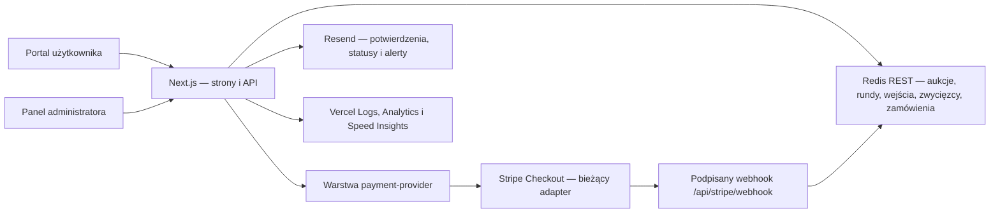

# Fiszy

Fiszy to portal aukcji ze spadającą ceną. Użytkownik opłaca wejście w kwocie ustawionej dla danej aukcji, obserwuje cenę malejącą w czasie i może spróbować kupić produkt jednym kliknięciem. Pierwszy poprawnie zapisany klik wygrywa; cena widoczna w chwili kliknięcia zostaje zamrożona dla zwycięzcy.

Repozytorium: `jryba94-maker/fiszy-mvp`

Technologia: Next.js 15 (App Router), React 19, TypeScript, Redis REST, neutralna warstwa dostawcy płatności z bieżącym adapterem Stripe Checkout i Vercel.

> To jest rozbudowane MVP przygotowane do dalszego rozwoju, a nie jeszcze kompletny system sprzedażowy. Wdrożenie na Production wymaga spełnienia wszystkich warunków opisanych w sekcji [Bramki Production](#bramki-production).

## Co działa

- publiczny katalog wielu aukcji;
- lekki landing marketingowy z zapisem na pierwszą aukcję, zgodą, źródłami UTM i eksportem listy e-mail w panelu;
- osobna strona każdej aukcji z zegarem, bieżącą ceną i stanami `waiting`, `live`, `payment_pending`, `sold` oraz `ended`;
- standardowa oferta dla przegranych: jednorazowy rabat równy opłacie wejściowej i konfigurowalny termin 1–90 dni;
- płatne wejście przez Stripe Checkout;
- atomowy wybór jednego zwycięzcy, również przy niemal równoczesnych kliknięciach;
- weryfikacja, że cena przesłana przez kupującego jest nadal aktualną ceną serwera;
- osobna płatność zwycięzcy za produkt i zebranie danych dostawy;
- idempotentny zapis opłaconego zamówienia po podpisanym webhooku Stripe;
- konto użytkownika i historia między urządzeniami pod `/moje-fiszy`;
- panel `/admin`: logowanie, globalne wskaźniki, wyszukiwanie i filtrowanie, tworzenie, edycja, archiwizowanie i przywracanie aukcji oraz planowanie kolejnych rund;
- automatyczne pobieranie wszystkich stron aukcji i zamówień do bezpiecznego limitu MVP 5000 rekordów na zbiór, dzięki czemu wskaźniki i filtry nie kończą się na pierwszej stronie;
- obsługa realizacji zamówień w stanach `new`, `preparing`, `shipped` i `delivered`, z przewoźnikiem, numerem przesyłki, notatką i ochroną przed nadpisaniem nowszej zmiany;
- siedem rodzajów wiadomości transakcyjnych: lista zainteresowanych, wejście, przypomnienie, wygrana, zamówienie, rabat po aukcji i zmiana realizacji; dodatkowo codzienny alert stanu Production przez zweryfikowany Resend;
- powiadomienia w „Moje Fiszy” prowadzące bezpośrednio do wygranej, rabatu, wysyłki albo odpowiedzi pomocy;
- eksport aktualnie przefiltrowanego widoku zamówień do CSV z neutralizacją wartości mogących zostać zinterpretowanych przez arkusz jako formuły;
- historia rund i uczestników oraz pomocniczy dziennik utworzenia i zmian aukcji, planowania rund i realizacji zamówień;
- zgodność ze starszymi trasami jednej aukcji podczas migracji MVP;
- Vercel Analytics, Speed Insights, publiczny health check i strukturalne logi serwera.

## Architektura



Najważniejsze elementy modelu:

- `AuctionRecord` przechowuje tożsamość aukcji, produkt, stan publikacji i numer rewizji;
- `AuctionConfig` jest migawką parametrów konkretnej rundy: `runId`, start, ceny, czas i zasady oferty po aukcji;
- wpis wejściowy potwierdza prawo danego identyfikatora uczestnika do udziału w konkretnej rundzie;
- zwycięzca jest zapisywany atomowo w Redisie, więc dwie instancje serwera nie mogą sprzedać tego samego produktu dwóm osobom;
- stan rekordu aukcji (`draft`, `published`, `archived`) jest niezależny od stanu jej rundy (`waiting`, `live`, `payment_pending`, `sold`, `ended`);
- zamówienie jest powiązane z `auctionId`, `runId`, zwycięzcą, operatorem i referencją płatności; stare rekordy bez pola operatora są interpretowane jako legacy Stripe;
- rabat przegranego jest przypisany do konta Clerk i konkretnej rundy, nie jest kodem do przekazania, nie łączy się z innym rabatem i może zostać wykorzystany tylko raz na ten sam produkt;
- limitowana oferta rezerwuje sztukę na czas Checkout, zwalnia ją po wygaśnięciu sesji i zużywa dopiero po podpisanym potwierdzeniu płatności;
- realizacja zamówienia ma własny numer rewizji; zapis compare-and-set (CAS) odrzuca próbę nadpisania zmiany wykonanej wcześniej w innym oknie;
- każda skuteczna zmiana realizacji tworzy trwały wpis audytowy bez danych kontaktowych i adresowych klienta;
- indeksy Redis umożliwiają stronicowanie katalogu, rund i zamówień bez przeszukiwania całej bazy;
- prefiks kluczy zawiera `VERCEL_ENV`, dzięki czemu dane `development`, `preview` i `production` mają osobne przestrzenie nazw. Każde środowisko powinno dodatkowo korzystać z osobnego zasobu Redis.

Moduły `lib/payment-provider.ts` i `lib/payment-types.ts` oddzielają konfigurację oraz trwałą własność referencji płatności od reszty domeny. Obecnie operacje delegują do Stripe bez zmiany dotychczasowego zachowania Checkout i webhooka. Jest to punkt integracji przygotowany pod przyszły adapter Przelewy24, a nie ukończona migracja do Przelewy24.

Cena maleje całkowitą liczbą złotych od ceny startowej do minimalnej. Ostatni fragment czasu jest oknem ceny minimalnej. Czas i cena autorytatywna zawsze pochodzą z serwera, nie z zegara przeglądarki.

## Trasy aplikacji

| Trasa | Dostęp | Przeznaczenie |
| --- | --- | --- |
| `/` | publiczny | landing i zapis e-mail na pierwszą aukcję |
| `/aukcje` | publiczny | katalog opublikowanych aukcji |
| `/aukcje/[auctionId]` | publiczny | udział w wybranej aukcji |
| `/moje-fiszy` | konto Clerk | profil, historia, zamówienia, obserwowane i pomoc |
| `/admin` | chroniony | panel operacyjny administratora |
| `/api/health` | publiczny | minimalna diagnostyka dostępności magazynu danych |
| `/api/admin/health` | administrator | diagnostyka Redis, Stripe, webhooka, sekretu i originu Checkout |
| `/api/auctions` | publiczny | stronicowany katalog aukcji |
| `/api/auctions/[auctionId]` | publiczny | stan jednej aukcji |
| `/api/auctions/[auctionId]/runs/[runId]/entry` | konto Clerk | stan wejścia i utworzenie Checkout opłaty wejściowej |
| `/api/auctions/[auctionId]/runs/[runId]/buy` | konto Clerk | atomowa próba wygrania i Checkout produktu |
| `/api/auctions/[auctionId]/runs/[runId]/purchase/cancel` | konto Clerk | anulowanie nieopłaconego Checkout zwycięzcy |
| `/api/account/activity` | konto Clerk | historia udziału, wygranych, zamówień i ofert po aukcji |
| `/api/account/discounts/[discountId]/checkout` | konto Clerk | rezerwacja oferty i utworzenie Checkout zakupu z rabatem |
| `/api/account/cases` | konto Clerk | lista i utworzenie sprawy pomocy, reklamacji, zwrotu lub odstąpienia |
| `/api/account/privacy` | konto Clerk | rejestr zgód i wniosków dotyczących danych osobowych |
| `/api/waitlist` | publiczny | zapis adresu e-mail ze zgodą i źródłem kampanii |
| `/api/stripe/webhook` | Stripe | podpisane potwierdzenia płatności i wygaśnięcia Checkout |
| `/api/admin/session` | administrator | utworzenie, sprawdzenie i usunięcie sesji |
| `/api/admin/auctions` | administrator | lista i tworzenie aukcji |
| `/api/admin/auctions/[auctionId]` | administrator | odczyt i edycja aukcji |
| `/api/admin/auctions/[auctionId]/duplicate` | administrator | utworzenie niezależnego szkicu na podstawie aukcji |
| `/api/admin/auctions/[auctionId]/runs` | administrator | stronicowana historia rund (`GET`) i zaplanowanie kolejnej rundy (`POST`) |
| `/api/admin/auctions/[auctionId]/runs/[runId]/participants` | administrator | stronicowana lista uczestników rundy z prawem wejścia i oznaczeniem zwycięzcy |
| `/api/admin/products` | administrator | katalog produktów, SKU, zdjęcia, status i stan magazynowy |
| `/api/admin/products/[productId]/auction-draft` | administrator | szkic aukcji z szablonu produktu |
| `/api/admin/orders` | administrator | stronicowana lista opłaconych zamówień |
| `/api/admin/orders/[orderId]/fulfillment` | administrator | odczyt stanu i historii realizacji (`GET`) oraz zmiana statusu, trackingu i notatki z kontrolą rewizji (`PATCH`) |
| `/api/admin/cases` | administrator | kolejka spraw użytkowników i ich obsługa z kontrolą rewizji |
| `/api/admin/privacy` | administrator | kolejka wniosków RODO i ich statusów |
| `/api/admin/analytics` | administrator | zagregowany lejek biznesowy bez surowych identyfikatorów użytkowników |
| `/api/admin/operations` | administrator | stan kolejki wiadomości i ręczne uzgodnienie procesów |
| `/api/admin/audit` | administrator | stronicowany pomocniczy dziennik zapisanych zmian, opcjonalnie filtrowany po typie i identyfikatorze zasobu |
| `/api/admin/waitlist` | administrator | stronicowana lista zapisów i pełny eksport CSV do limitu 10 000 rekordów |
| `/api/cron/system-health` | Vercel Cron | codzienna kontrola Production i alert e-mail przy degradacji |
| `/api/cron/operations` | Vercel Cron | uzgodnienie cyklu aukcji i ponowienia kolejki wiadomości |

Trasy `/api/auction/**` i `/api/admin/auction/start` są adapterami zgodności dla wcześniejszej, pojedynczej aukcji. Nowe funkcje powinny korzystać z tras `/api/auctions/**`.

## Wymagania lokalne

- Node.js 20 lub nowszy dla aplikacji, buildu i pełnej suity testów;
- npm zgodny z plikiem `package-lock.json`;
- dostęp do projektu Vercel `fiszy-mvp`;
- osobny zasób Redis przeznaczony dla Development;
- klucze Stripe wyłącznie w trybie testowym;
- port `3000` dostępny lokalnie.

## Pierwsze uruchomienie na komputerze

### 1. Pobierz repozytorium i zależności

```powershell
git clone https://github.com/jryba94-maker/fiszy-mvp.git
Set-Location fiszy-mvp
npm ci
```

Jeżeli repozytorium jest już podłączone do Codex, wystarczy pracować w istniejącym katalogu i wykonać `npm ci` po zmianie `package-lock.json`.

### 2. Połącz lokalny katalog z właściwym projektem Vercel

Wykonuje się to raz na nowym komputerze:

```powershell
npx vercel@58.9.0 link
```

Przed zatwierdzeniem sprawdź nazwę zespołu i projektu. Plik `.vercel/project.json` jest lokalny i ignorowany przez Git.

### 3. Pobierz wyłącznie ustawienia Development

```powershell
npx vercel@58.9.0 env pull .env.local --environment=development --yes
```

Nie pobieraj do pracy lokalnej ustawień Production. Polecenie `env pull` zastępuje cały wskazany plik, dlatego własne ustawienia lokalne trzymaj w `.env.development.local`, który ma wyższy priorytet.

Minimalny `.env.development.local` powinien odpowiadać szablonowi `.env.example` i zawierać tylko dane testowe. W szczególności:

```dotenv
VERCEL_ENV=development
FISZY_DEFAULT_CHECKOUT_ORIGIN=http://127.0.0.1:3000
FISZY_ALLOWED_CHECKOUT_ORIGINS=http://127.0.0.1:3000,http://localhost:3000
FISZY_RACE_TEST_REDIS_URL_SHA256=<sha256-zatwierdzonego-adresu-development-redis>
```

Możesz sprawdzić same nazwy wczytanych zmiennych bez ujawniania wartości:

```powershell
Get-Content .env.local,.env.development.local | Where-Object { $_ -match '^[A-Z][A-Z0-9_]*=' } | ForEach-Object { ($_ -split '=',2)[0] } | Sort-Object -Unique
```

Nigdy nie wklejaj zawartości `.env.local` do rozmowy, logu, zgłoszenia ani commita.

### 4. Uruchom aplikację

```powershell
npm run dev
```

Otwórz:

- portal: `http://127.0.0.1:3000/`;
- panel: `http://127.0.0.1:3000/admin`;
- health check: `http://127.0.0.1:3000/api/health`.

### 5. Uruchom lokalny webhook Stripe

W drugim terminalu, gdy serwer na porcie 3000 już działa:

```powershell
npm run stripe:listen
```

Skrypt:

- odmawia startu poza `VERCEL_ENV=development`;
- wymaga klucza `sk_test_...`;
- sprawdza, czy lokalny `STRIPE_WEBHOOK_SECRET` pasuje do uruchomionego listenera;
- przekazuje tylko obsługiwane zdarzenia do `http://127.0.0.1:3000/api/stripe/webhook`;
- maskuje klucze Stripe w swoim wyjściu.

## Zmienne środowiskowe

| Zmienna | Development | Preview | Production | Znaczenie |
| --- | --- | --- | --- | --- |
| `VERCEL_ENV` | ustaw lokalnie na `development` | wstrzykuje Vercel | wstrzykuje Vercel | przestrzeń nazw danych i tryb zabezpieczeń; nie ustawiaj ręcznie w Vercel |
| `NEXT_PUBLIC_SITE_URL` | `http://127.0.0.1:3000` | stały alias HTTPS Preview | kanoniczna domena HTTPS | canonical, sitemap, robots i karty udostępniania |
| `CLERK_SECRET_KEY` / `NEXT_PUBLIC_CLERK_PUBLISHABLE_KEY` | instancja testowa | instancja testowa Preview | produkcyjna instancja Clerk | logowanie, sesje i konto użytkownika |
| `KV_REST_API_URL` | Development Redis | osobny Preview Redis | osobny Production Redis | serwerowy adres Redis REST |
| `KV_REST_API_TOKEN` | token Development | token Preview | token Production | serwerowy token Redis REST |
| `STRIPE_SECRET_KEY` | `sk_test_...` | `sk_test_...` | `sk_live_...` | serwerowy klucz Stripe |
| `STRIPE_WEBHOOK_SECRET` | sekret lokalnego listenera | sekret endpointu Preview, jeśli jest używany | sekret live endpointu Production | weryfikacja podpisu webhooka |
| `FISZY_ADMIN_SECRET` | osobny, co najmniej 32 losowe znaki | inny sekret Preview | inny sekret Production | podpis sesji i awaryjne uwierzytelnienie API |
| `FISZY_ADMIN_USERS_JSON` | opcjonalna mapa kont Clerk | mapa testowych administratorów | zatwierdzona mapa kont i ról | indywidualne role `owner`, `operator`, `support`, `viewer` i pseudonimowy aktor audytu |
| `FISZY_RATE_LIMIT_SECRET` | co najmniej 32 losowe bajty | inny sekret Preview | inny sekret Production | niezależna sól HMAC dla kluczy limitu publicznych żądań |
| `FISZY_PAYMENT_PROVIDER` | `stripe` | `stripe` | `stripe` do zatwierdzonej migracji | wybór adaptera; ustawienie `przelewy24` pozostaje fail-closed |
| `P24_MERCHANT_ID`, `P24_POS_ID`, `P24_CRC`, `P24_API_KEY`, `P24_SANDBOX` | opcjonalne | testowe po osobnej zgodzie | nie ustawiaj przed testami | przygotowana konfiguracja przyszłego adaptera Przelewy24, bez aktywnych wywołań sieciowych |
| `FISZY_DEFAULT_CHECKOUT_ORIGIN` | `http://127.0.0.1:3000` | stały HTTPS alias Preview albo automatyczny `VERCEL_URL` | wymagany kanoniczny adres HTTPS | bazowy powrót ze Stripe Checkout |
| `FISZY_ALLOWED_CHECKOUT_ORIGINS` | oba lokalne originy | wyłącznie zatwierdzone originy Preview | kanoniczna domena i tylko potrzebne aliasy HTTPS | lista dokładnych originów dopuszczonych do powrotu |
| `FISZY_RACE_TEST_REDIS_URL_SHA256` | wymagany przez testy mutujące | nie ustawiaj | nie ustawiaj | odcisk zatwierdzonego Development Redis |
| `RESEND_API_KEY` | osobny klucz testowy lub brak | osobny klucz Preview | klucz zasobu Production | serwerowa wysyłka wiadomości przez Resend |
| `FISZY_EMAIL_FROM` | zatwierdzony nadawca testowy | nadawca Preview | nadawca w zweryfikowanej domenie `fiszy.pl` | adres nadawcy wiadomości transakcyjnych |
| `FISZY_ALERT_EMAIL` | adres testowy | adres testowy | skrzynka operacyjna, obecnie `rodo@fiszy.pl` | odbiorca alertów diagnostycznych |
| `CRON_SECRET` | opcjonalny lokalnie | osobny sekret | silny losowy sekret Production | autoryzacja wywołania codziennej diagnostyki |

Kod akceptuje również nazwy Redis tworzone przez niektóre integracje Vercel: `STORAGE_KV_REST_API_URL` + `STORAGE_KV_REST_API_TOKEN` albo `UPSTASH_REDIS_REST_URL` + `UPSTASH_REDIS_REST_TOKEN`. Skonfiguruj jedną pasującą parę, nie mieszaj adresu z tokenem innego zasobu.

Wszystkie powyższe zmienne są serwerowe. Projekt nie potrzebuje obecnie żadnego sekretu z prefiksem `NEXT_PUBLIC_`; taki prefiks ujawniłby wartość w przeglądarce.

Zasady środowisk:

- Development, Preview i Production muszą mieć osobne zasoby Redis i osobne sekrety;
- Development i Preview używają wyłącznie Stripe Test Mode;
- Production używa kompletu Stripe Live: klucz live, osobny live webhook i live endpoint;
- po zmianie zmiennej Vercel wykonaj nowe wdrożenie; istniejący deployment nie otrzyma automatycznie nowej konfiguracji;
- wartości zapisuj jako Sensitive w Vercel i nigdy nie przesyłaj ich przez Git.

## Przepływ Stripe

1. Od publikacji zaplanowanej rundy do chwili jej startu użytkownik może zainicjować opłatę wejściową. Serwer ogranicza liczbę prób i tworzy Stripe Checkout za kwotę ustawioną dla aukcji; po starcie nie pozwala już dołączyć.
2. Dopiero podpisany webhook `checkout.session.completed` lub `checkout.session.async_payment_succeeded` zapisuje prawo wejścia.
3. Podczas aukcji cena spada skokowo o wartość opłaty wejściowej, a wszystkie punkty cenowe są równomiernie rozłożone na czas rundy. Serwer ponownie sprawdza rundę, prawo wejścia, czas i cenę.
4. Atomowa operacja Redis wybiera dokładnie jednego zwycięzcę.
5. Dla zwycięzcy powstaje idempotentna sesja Checkout produktu; kolejne żądanie tego samego zwycięzcy odzyskuje tę samą sesję.
6. Podpisany webhook zapisuje opłacone zamówienie i dane dostawy. Duplikat webhooka nie tworzy drugiego zamówienia.
7. `checkout.session.expired` może zwolnić nieopłacone roszczenie zwycięzcy zgodnie ze stanem serwera.

Endpoint webhooka w środowisku zdalnym:

```text
https://<dokładna-domena>/api/stripe/webhook
```

W Stripe trzeba subskrybować:

- `checkout.session.completed`;
- `checkout.session.async_payment_succeeded`;
- `checkout.session.expired`.

Sekret `whsec_...` należy do konkretnego endpointu i trybu Stripe. Sekret lokalnego listenera nie jest sekretem Preview ani Production. Webhook odczytuje surowe body i weryfikuje nagłówek `stripe-signature`; proxy nie może zmieniać treści żądania.

Chronionego Vercel Preview nie należy otwierać publicznie tylko po to, aby przyjąć webhook. Pełny przepływ webhooka testujemy lokalnie. Jeżeli powstanie stałe środowisko staging, jego dostęp dla Stripe należy zaprojektować osobno bez wyłączania ochrony całego Preview.

## Panel administratora

Panel działa pod `/admin`. Sekret jest wysyłany tylko podczas logowania i zamieniany na podpisaną sesję w ciasteczku `HttpOnly`, `SameSite=Strict`; sesja trwa maksymalnie 8 godzin. Logowanie ma limit 10 prób na 15 minut dla jednego źródła.

Alternatywnie `FISZY_ADMIN_USERS_JSON` mapuje konkretne identyfikatory Clerk na role. Po zalogowaniu Clerk trasa sesji wystawia krótką, podpisaną sesję panelu, a audyt zapisuje pseudonimowy identyfikator pracownika bez przechowywania jego identyfikatora Clerk. Produkcyjne wymuszenie MFA nadal konfiguruje się po stronie Clerk; sama aplikacja nie powinna udawać, że potrafi potwierdzić ten zewnętrzny stan.

Po zalogowaniu panel pobiera kolejne strony aukcji i zamówień po 50 rekordów. Bezpieczny limit MVP wynosi 100 stron, czyli 5000 rekordów na zbiór. Jeżeli API zwróci zapętlony kursor albo limit zostanie osiągnięty, panel przerywa operację z widocznym błędem zamiast pokazywać niepełne wskaźniki jako kompletne dane.

Typowy proces pracy:

1. Sprawdź sekcję „Stan systemu”. Degradacja Redis, Stripe lub webhooka oznacza zakaz uruchamiania płatnej aukcji.
2. Utwórz aukcję jako szkic albo podaj przyszły termin i od razu ją zaplanuj.
3. Sprawdź nazwę, slug, zdjęcie, cenę regularną, startową, minimalną oraz czas trwania.
4. Opublikuj pierwszą lub kolejną rundę. Bez podanego czasu serwer planuje start z bezpiecznym opóźnieniem.
5. Nie edytuj parametrów ani nie archiwizuj aktywnej aukcji. API blokuje taką zmianę konfliktem `409`. Zakończoną aukcję można archiwizować i później przywrócić bez usuwania historii.
6. W historii aukcji sprawdź wcześniejsze rundy, ich uczestników, zwycięzcę i powiązane zamówienie.
7. Po opłaceniu produktu sprawdź zamówienie, dane kontaktowe i adres dostawy; można skopiować dane wysyłkowe albo wyeksportować aktualnie widoczny zestaw do CSV.
8. Prowadź realizację od `new` przez `preparing` i `shipped` do `delivered`. Status wysłany lub doręczony wymaga przewoźnika i numeru przesyłki. Konflikt rewizji `409` oznacza, że dane zmieniono w innym oknie i trzeba je odświeżyć.
9. W pomocniczym dzienniku działań sprawdź utworzenie i zmiany aukcji, planowanie rund oraz zmiany realizacji. Wspólny sekret administratora pozwala rozpoznać typ sesji, ale nie konkretną osobę. Zdarzenia są przechowywane przez 180 dni. Zmiana realizacji i jej wpis powstają atomowo; wpisy dotyczące aukcji są dopisywane po udanej operacji i przy awarii tego drugiego zapisu mogą wymagać odtworzenia z logów.
10. Po pracy wyloguj sesję administratora.

### Operacje uruchamiane automatycznie

- stan cyklu aukcji jest wyliczany z serwerowego czasu, zwycięzcy i zamówienia, a kontrolny checkpoint rozpoznaje `entry_open`, `live`, `ended`, `payment_pending`, `payment_recovery_required`, `sold` i `archived`;
- Vercel Cron raz dziennie uzgadnia checkpointy wszystkich aukcji oraz ponawia wiadomości z kolejki; bieżące zdarzenia próbują wysłać wiadomość również od razu, a przypomnienia godzinę i 10 minut przed startem są planowane po stronie Resend;
- kolejka wiadomości ma deduplikację, dzierżawę, wykładnicze ponowienia, stan `dead` po ośmiu próbach oraz retencję 90 dni;
- panel „Operacje” pozwala uruchomić uzgodnienie ręcznie i pokazuje wiadomości wymagające uwagi;
- płatność już zapisanego zamówienia nie jest cofana przez rozbieżność magazynową; taka sytuacja trafia do logów jako obowiązkowe uzgodnienie produktu.

### Katalog produktów i szkice

Produkt jest niezależnym rekordem z SKU, kategorią, maksymalnie sześcioma adresami zdjęć, statusem, opcjonalnie śledzonym stanem magazynowym i szablonem aukcji. Z produktu można utworzyć szkic aukcji, a istniejącą aukcję zduplikować. Każdy szkic nadal wymaga sprawdzenia i osobnej publikacji. Powiązanie produktu z aukcją umożliwia idempotentne zmniejszenie śledzonego stanu dopiero po zapisaniu opłaconego zamówienia.

### Sprawy klientów, analityka i prywatność

- użytkownik może utworzyć pomoc, reklamację, zwrot lub odstąpienie; zwrot i odstąpienie wymagają numeru zamówienia, a sprawa ma numer, termin odpowiedzi, rewizję, status i odpowiedź zespołu;
- panel pokazuje kolejkę spraw oraz wniosków dotyczących dostępu, sprostowania, usunięcia, ograniczenia i sprzeciwu;
- zmiana zgód marketingowych i analitycznych tworzy niezmienny, wersjonowany wpis; bieżący stan profilu i historia zgód są eksportowane razem z danymi konta;
- lejek zapisuje tylko dzienne liczniki zdarzeń i kampanii, bez adresów e-mail oraz identyfikatorów kont;
- zakończenie wniosku o usunięcie pozostaje kontrolowaną procedurą operatora, ponieważ trzeba osobno uwzględnić Clerk, Resend oraz ustawowe okresy przechowywania zamówień i płatności.

Stan rekordu aukcji jest niezależny od stanu rundy. Stany rekordu:

- `draft` — aukcja nie jest widoczna w katalogu;
- `published` — aukcja może być widoczna i przyjmować kolejne rundy;
- `archived` — rekord pozostaje w danych, ale nie jest publiczny i nie przyjmuje nowej rundy.

Stany rundy:

- `waiting` — runda opublikowana, start w przyszłości;
- `live` — trwa spadek ceny;
- `payment_pending` — zwycięzca ma czas na płatność;
- `sold` — płatność produktu potwierdzona i zamówienie zapisane;
- `ended` — czas minął bez sprzedaży.

Stany realizacji zamówienia:

- `new` — nowe opłacone zamówienie czeka na obsługę;
- `preparing` — zamówienie jest przygotowywane;
- `shipped` — przesyłka wysłana; wymagany jest przewoźnik i numer przesyłki;
- `delivered` — przesyłka doręczona; dane śledzenia pozostają wymagane.

Slug powinien być stabilny, małymi literami, bez polskich znaków, np. `playstation-5`. Zdjęcie może być ścieżką lokalną zaczynającą się od `/` albo publicznym HTTPS. Backend odrzuca adresy prywatne, lokalne, uwierzytelnione i nie-HTTPS.

## Status bieżącej iteracji

Ta iteracja rozszerza portal o katalog produktów i szablony, duplikowanie szkiców, checkpointy cyklu aukcji, trwałą kolejkę wiadomości, indywidualne role administratorów, sprawy reklamacji/zwrotów, zagregowany lejek, rejestr zgód i wniosków prywatności oraz neutralny kontrakt sesji płatniczej. Stripe pozostaje jedynym aktywnym adapterem; Przelewy24 jest przygotowane konfiguracyjnie, lecz celowo zablokowane do osobnego etapu z podpisami webhooka i pełną weryfikacją płatności.

W Production skonfigurowano domenę `fiszy.pl`, Clerk, Redis, Resend oraz codzienny mechanizm alertów. Sentry nie został włączony z powodu błędu instalacji Marketplace; niezależne alerty krytyczne realizuje obecnie kontrola Cron + Resend. Bieżące zmiany kodu przed kolejnym wdrożeniem nadal wymagają pełnej suity testów i kontroli deploymentu.

## Weryfikacja przed wysłaniem zmian

Najpierw testy niemutujące:

```powershell
npm ci
npm run check:security
npm run typecheck
npm run test:admin:unit
npm run test:history:unit
npm run build
```

`npm run build` uruchamiaj po zatrzymaniu `npm run dev`, ponieważ oba procesy korzystają z katalogu `.next`.

Testy `test:admin:unit`, `test:history:unit`, `test:portal:unit` i `test:operations:unit` są deterministyczne, nie łączą się z operatorem płatności ani z zewnętrznym Redis i są wykonywane w CI. Test operacji potwierdza między innymi reguły katalogu, spraw klientów, fail-closed Przelewy24, schemat audytu i pełne przejście wiadomości listy przez kolejkę.

Przed ponownym wdrożeniem przepływu płatności lub decyzją o Production uruchom osobno odłożone testy integracyjne płatności w zatwierdzonym Development:

```powershell
npm run dev
```

W osobnym terminalu:

```powershell
npm run test:faults
npm run test:faults:unit
npm run test:portal
npm run test:race
```

`test:faults` sprawdza wygaśnięte i sfałszowane sesje administratora, ochronę przed żądaniami cross-site, podpisy i limit czasu webhooka, powtórzone oraz przestawione zdarzenia Stripe, limit prób logowania i operacje compare-and-set zwycięzcy. Wariant `test:faults:unit` uruchamia wyłącznie deterministyczną część bez połączeń z Redis i jest wykonywany w CI.

`test:portal` tworzy dwie aukcje o losowych identyfikatorach, sprawdza izolację, walidację, dwie niezależne sesje Stripe, nieaktualną cenę oraz równoległą ponowną próbę zwycięzcy, po czym usuwa wyłącznie utworzone przez siebie dane.

`test:race` tymczasowo uruchamia kontrolowaną rundę starszej aukcji, symuluje dwóch uczestników klikających równocześnie, sprawdza jednego zwycięzcę i przywraca poprzednią konfigurację. Oba skrypty odmawiają pracy, jeżeli środowisko nie jest `development`, Stripe nie jest testowy albo SHA-256 adresu Redis nie odpowiada jawnie zatwierdzonemu zasobowi.

Po testach wykonaj ręczny smoke test:

- szerokość telefonu około 360 px i widok desktopowy;
- katalog, szczegóły aukcji i `/moje-fiszy`;
- logowanie, odświeżenie i wylogowanie `/admin`;
- wejście testową kartą Stripe, powrót do właściwej aukcji i zapis prawa wejścia;
- dwa urządzenia lub dwa odseparowane profile przeglądarki: dokładnie jeden zwycięzca;
- płatność produktu, pojawienie się statusu `sold` i zamówienia w panelu;
- anulowanie oraz wygaśnięcie nieopłaconej sesji;
- brak błędów w konsoli przeglądarki i logach serwera.

## CI i praca z GitHub

Standardowy przepływ:

```text
branch roboczy → commit → push → Draft PR → CI → review → Vercel Preview → decyzja o merge
```

GitHub Actions uruchamia na PR i na `main`:

- `npm ci`;
- audyt zależności produkcyjnych;
- kontrolę TypeScript;
- deterministyczne testy bezpieczeństwa, realizacji zamówień i historii;
- produkcyjny build Next.js.

Nie commituj `.env*`, `.vercel/`, logów ani sekretów. PR powinien opisywać zmianę zachowania, ryzyko, wykonane testy i plan wycofania. Merge do gałęzi uruchamiającej Production jest zmianą produkcyjną i wymaga osobnej, świadomej zgody.

## Vercel Preview

Preview jest miejscem do sprawdzenia zdalnego buildu i UI, ale nie może korzystać z danych ani kluczy Production.

1. Ustaw osobne zmienne w zakresie Preview. Nazwy można sprawdzić bez odczytywania wartości:

   ```powershell
   npx vercel@58.9.0 env ls preview
   ```

2. Upewnij się, że Stripe jest w Test Mode, Redis jest Preview-only, a sekret administratora jest inny niż na pozostałych środowiskach.
3. Wypchnij gałąź i pozwól integracji Git utworzyć Preview albo jawnie wykonaj:

   ```powershell
   npx vercel@58.9.0 deploy
   ```

4. Zachowaj Vercel Deployment Protection. Do automatycznej diagnostyki chronionego deploymentu używaj mechanizmu dostępu Vercel, nie wyłączaj ochrony.
5. Sprawdź `/api/health`, UI, responsywność, nagłówki bezpieczeństwa, logowanie administratora oraz logi deploymentu.
6. Test płatności i webhooka wykonuj wyłącznie z izolowanymi danymi testowymi. Brak działającego webhooka Preview musi być jawnie widoczny jako degradacja, nigdy zamaskowany sekretem z innego endpointu.

## Bramki Production

Production nie jest „kolejnym kliknięciem” po Preview. Wdrożenie jest dozwolone dopiero po spełnieniu każdego punktu i zapisaniu wyniku w PR lub checklistcie wydania.

### Bramki egzekwowane przez aplikację

- Redis jest skonfigurowany i odpowiada;
- `STRIPE_SECRET_KEY` ma tryb zgodny ze środowiskiem: `sk_live_...` dla Production;
- `STRIPE_WEBHOOK_SECRET` jest obecny;
- `FISZY_DEFAULT_CHECKOUT_ORIGIN` jest jawnym adresem HTTPS;
- `FISZY_ADMIN_SECRET` ma co najmniej 32 losowe znaki i nie zaczyna się od typowego hasła;
- chroniony `/api/admin/health` zwraca `healthy: true` oraz HTTP 200.

### Bramki operacyjne wymagające decyzji człowieka

- CI, build, testy błędów bezpieczeństwa, test portalu, test wyścigu i ręczny scenariusz dwóch użytkowników zakończyły się powodzeniem;
- Vercel Preview dokładnie tego commita został zaakceptowany na telefonie i desktopie;
- Production ma własny Redis, własny silny sekret administratora i komplet Stripe Live;
- live webhook wskazuje dokładną domenę Production, ma właściwe trzy zdarzenia i został przetestowany;
- domena, HTTPS, powroty Checkout i Vercel Deployment/Firewall są sprawdzone;
- istnieje aktualna kopia lub snapshot danych Redis oraz sprawdzona procedura odtworzenia;
- znany jest ostatni dobry deployment i osoba podejmująca decyzję o rollbacku;
- ustalone są procedury zwrotu środków, wysyłki, reklamacji, podatków, regulaminu, prywatności i retencji danych klienta;
- monitoring i alertowanie obejmują błędy webhooka, błędy Redis, wzrost odpowiedzi 5xx i brak potwierdzeń zamówień;
- właściciel ryzyka zaakceptował ograniczenia MVP opisane niżej.

Nie używaj testu wyścigu, testu portalu ani ręcznych komend Redis na Production. Nie kopiuj danych Development/Preview do Production. Nie podmieniaj jednego klucza środowiska bez sprawdzenia całej pary adres + token + tryb Stripe.

Jeżeli choć jedna bramka nie jest spełniona, kończymy na chronionym Preview. To jest bezpieczny, oczekiwany wynik procesu, a nie nieudane wdrożenie.

## Wdrożenie i obserwacja

Preferowany model to automatyczny Preview dla PR i kontrolowane wdrożenie z `main` dopiero po akceptacji bramek. Jeżeli wdrożenie wykonywane jest ręcznie, zawsze najpierw sprawdź cel poleceniem `vercel inspect`/`vercel ls` i nie dodawaj flagi `--prod` przed formalną zgodą.

Po wdrożeniu Production:

1. sprawdź wersję commita i status deploymentu;
2. wywołaj publiczny `/api/health`;
3. zaloguj się do `/admin` i potwierdź wszystkie pola `/api/admin/health`;
4. przejrzyj błędy w Vercel Runtime Logs;
5. przeprowadź kontrolowaną transakcję live o zatwierdzonej wartości albo wcześniej uzgodniony test bez obciążenia klienta;
6. potwierdź webhook, zamówienie i dane dostawy;
7. obserwuj logi i metryki co najmniej przez pierwszą pełną rundę.

Publiczny health check celowo nie ujawnia nazw usług ani sekretów. Dokładna diagnostyka jest dostępna dopiero po uwierzytelnieniu administratora. Logi strukturalne zawierają środowisko i skrócony commit; nie wolno dodawać do nich kluczy, tokenów, pełnych danych karty ani sekretu administratora.

## Rollback

Rollback kodu i rollback danych to dwie oddzielne operacje.

### Kod

1. Zatrzymaj uruchamianie nowych aukcji.
2. Zidentyfikuj ostatni deployment, który przeszedł pełną weryfikację.
3. Przełącz alias Production na znany dobry deployment przez panel Vercel albo kontrolowane `vercel rollback <deployment>`.
4. Sprawdź `/api/health`, `/api/admin/health`, stronę jednej aukcji i przyjęcie podpisanego webhooka.
5. Zachowaj logi oraz identyfikatory nieprzetworzonych zdarzeń Stripe do późniejszego uzgodnienia.

### Dane i płatności

- Vercel rollback nie cofa Redis ani zdarzeń Stripe;
- nie usuwaj ręcznie zwycięzcy lub zamówienia bez sprawdzenia stanu sesji Stripe;
- przed zmianą schematu wykonaj snapshot/eksport dostawcy Redis i sprawdź możliwość odtworzenia;
- webhooki mogą zostać dostarczone ponownie lub z opóźnieniem, dlatego wycofana wersja musi zachować kompatybilność z aktywnymi sesjami;
- płatności i zamówienia uzgadniaj według `paymentSessionId`, `auctionId` i `runId`;
- zwrot pieniędzy wykonuj w Stripe zgodnie z zatwierdzoną procedurą, nie przez usunięcie rekordu Redis.

Po incydencie utwórz osobną gałąź naprawczą i nowe Preview. Nie „naprawiaj na żywo” plików deploymentu ani danych szeroką komendą czyszczącą.

## Zabezpieczenia obecne w MVP

- sekrety wyłącznie po stronie serwera i pliki `.env*` ignorowane przez Git;
- podpisy Stripe i surowe body webhooka;
- atomowe operacje Redis dla zwycięzcy i idempotentny zapis zamówienia;
- ochrona przed nieaktualną ceną (`expectedPrice`);
- limit tworzenia płatnych wejść: 30 prób na IP i 6 na uczestnika w 10 minut dla jednej rundy;
- limit logowania administratora;
- podpisana, wygasająca sesja `HttpOnly` i kontrola originu mutacji administratora;
- kontrola dokładnego originu również dla zmian profilu, obserwowanych, zgłoszeń i powiadomień użytkownika;
- kontrola rewizji przy równoległej edycji aukcji;
- walidacja cen, czasu, slugów i adresów zdjęć;
- nagłówki `nosniff`, `DENY` dla ramek, podstawowe restrykcje CSP, ograniczenia uprawnień, COOP/CORP oraz HSTS na Production;
- separowane HMAC dla pseudonimowych liczników ruchu; Production odmawia działania limitu bez sekretu serwerowego;
- brak indeksowania Development i Preview przez roboty;
- izolacja kluczy Redis według środowiska;
- testy destrukcyjne z blokadą na zatwierdzony Development Redis i Stripe Test Mode.

## Portal użytkownika i obsługa

Po zalogowaniu przez Clerk ekran `/moje-fiszy` korzysta z trwałych danych Redis przypisanych do konta. Obejmuje profil, adres, zgody, historię rund, wygrane, zamówienia i wysyłki, obserwowane aukcje, eksport danych, zgłoszenia oraz trwały stan przeczytanych powiadomień. Nowe akcje aukcyjne używają identyfikatora `clerk:<userId>` wyznaczanego wyłącznie na serwerze.

Kategoria produktu jest częścią definicji aukcji i jest ustawiana w panelu administratora. Starsze rekordy bez tego pola otrzymują bezpieczną kategorię na podstawie nazwy produktu, dlatego migracja jest addytywna i nie wymaga przepisywania danych. Production publikuje również manifest aplikacji, grafikę Open Graph, canonicale, dynamiczne metadane aukcji oraz sitemapę ograniczoną do publicznych treści.

Panel administratora zawiera katalog produktów, aukcje, zamówienia, użytkowników, sprawy klientów, wnioski prywatności, analitykę, operacje i audyt. `FISZY_ADMIN_ROLE` oraz indywidualna mapa `FISZY_ADMIN_USERS_JSON` obsługują role `owner`, `operator`, `support` i `viewer`; mutacje aukcji, realizacji, kont i obsługi są sprawdzane osobno. Wspólny sekret pozostaje dostępem awaryjnym, natomiast sesja konkretnego konta Clerk otrzymuje pseudonimowy identyfikator audytu. Wymuszenie MFA i cykl zapraszania/usuwania pracowników pozostają obowiązkiem konfiguracji Clerk.

Powiadomienia wymagające działania są generowane w portalu i prowadzą do właściwej sekcji. Wszystkie wiadomości transakcyjne przechodzą przez trwałą kolejkę: potwierdzenie listy, potwierdzenie wejścia, przypomnienia przed startem, wygrana, potwierdzenie zamówienia, rabat po aukcji, zmiana realizacji oraz odpowiedź na sprawę klienta. Wysyłka ma limit czasu, klucz idempotencji i nie cofa poprawnie zapisanej operacji, gdy dostawca poczty jest chwilowo niedostępny. Codzienny Cron ponawia kolejkę oraz wysyła alert wyłącznie przy wykryciu degradacji; powodzenie zapisuje w logach bez generowania wiadomości.

Strony `/regulamin`, `/zasady-aukcji`, `/prywatnosc`, `/cookies`, `/reklamacje` i `/faq` są kompletnym szkieletem operacyjnym, ale jawnie oznaczonym jako roboczy. Przed publiczną sprzedażą prawnik musi uzupełnić dane operatora, podstawy prawne, terminy, formularz odstąpienia i zasady opłaty za wejście.

## Kopie danych portalu

Preferowanym źródłem kopii Production jest snapshot lub eksport zarządzany przez dostawcę Redis. Repo zawiera dodatkowy, wyłącznie odczytowy eksport awaryjny:

```powershell
$env:FISZY_BACKUP_OUTPUT = "D:\bezpieczne-kopie\fiszy-preview.json"
npm run backup:export
```

Plik może zawierać dane osobowe i nie może trafić do repozytorium, zwykłego dysku współdzielonego ani logów CI. Skrypt wymaga jawnej, absolutnej ścieżki, nie nadpisuje istniejącego pliku i dla Production dodatkowo wymaga `-- --allow-production-read`. Sam nie przywraca danych. Odtworzenie zawsze wykonujemy najpierw do odseparowanego Preview, walidujemy liczbę i typy kluczy, a dopiero potem podejmujemy osobną decyzję operacyjną.

Minimalny test odzyskiwania raz w miesiącu: utworzenie snapshotu, odtworzenie do pustego zasobu testowego, uruchomienie `/api/health`, odczyt katalogu, konta testowego, zamówienia i audytu oraz usunięcie zasobu testowego po zapisaniu wyniku.

## Znane ograniczenia i dalszy rozwój

- starsze, anonimowe wpisy zapisane przed wdrożeniem Clerk mogą pozostać wyłącznie w `localStorage`; nie są automatycznie przypisywane do nowego konta bez bezpiecznego procesu migracji;
- profil i historia konta działają przez Clerk, a portal rejestruje zgody i wnioski prywatności; finalne okresy retencji oraz procedura usunięcia danych z Clerk, Resend i dokumentów finansowych wymagają zatwierdzenia prawnego;
- indywidualne role administratorów są gotowe w aplikacji, ale wymuszenie MFA, procedura nadawania dostępu i okresowy przegląd uprawnień muszą zostać skonfigurowane i udokumentowane w Clerk;
- wpisy dziennika i jego indeksy mają automatyczną retencję 180 dni; polityka danych osobowych całego portalu nadal wymaga formalnego zatwierdzenia;
- sprawy reklamacji, zwrotów i odstąpień mają kolejkę i statusy, ale automatyczne zwroty środków, etykiety zwrotne, faktury i księgowość pozostają poza aplikacją;
- przed publiczną sprzedażą trzeba formalnie wdrożyć zasady retencji i usuwania danych osobowych;
- alert e-mail stanu Production działa raz dziennie, ale brak zewnętrznego error trackera, alertów czasu rzeczywistego oraz dyżuru operacyjnego;
- warstwa `payment-provider` nadal deleguje do Stripe; rzeczywista integracja Przelewy24, migracja danych referencyjnych i testy nowego przepływu są odłożone;
- mechanika wejścia za opłatą i aukcji wymaga weryfikacji prawnej, regulaminu i zasad ochrony konsumenta;
- katalog przyjmuje adresy zdjęć, ale nie ma jeszcze zarządzanego uploadu, transformacji i moderacji plików;
- Cron na planie Hobby działa raz dziennie; krytyczne procesy wymagające krótszego SLA powinny później dostać kolejkę/Workflow albo zatwierdzony wyższy plan.

Najbliższy etap po weryfikacji Preview powinien objąć konfigurację MFA i realnych kont zespołu, próbę operacyjną zwrotu od zgłoszenia do księgowania, alerty czasu rzeczywistego, finalną akceptację prawną i zatwierdzenie retencji. Migracja płatności do Przelewy24 pozostaje osobnym etapem po ustaleniu wymagań, podpisów webhooka i pełnej suity płatniczej.

## Najczęstsze problemy

| Objaw | Sprawdzenie |
| --- | --- |
| `/api/health` zwraca 503 | czy adres i token należą do tej samej instancji Redis |
| panel pokazuje brak konfiguracji | czy `FISZY_ADMIN_SECRET` istnieje i aplikacja została ponownie uruchomiona/wdrożona |
| logowanie zwraca 429 | odczekaj wskazany `Retry-After`; nie obchodź limitu |
| Stripe nie otwiera Checkout | tryb klucza, health administratora i dokładny `FISZY_DEFAULT_CHECKOUT_ORIGIN` |
| opłata przeszła, ale brak wejścia/zamówienia | działanie listenera/endpointu, sekret właściwego endpointu i Runtime Logs |
| powrót ze Stripe prowadzi na inną domenę | domyślny origin i lista dozwolonych originów dla danego środowiska |
| test odmawia startu | wymagane `development`, `sk_test_...` i poprawny hash Development Redis |
| build zachowuje się niestabilnie | zatrzymaj `next dev`, usuń tylko generowany `.next` po potwierdzeniu celu, wykonaj `npm ci` i ponów build |
| lokalnie działa, Preview nie | porównaj nazwy zmiennych bez ujawniania wartości i sprawdź logi zdalnego buildu/runtime |

## Zasada bezpieczeństwa projektu

Każda zmiana przechodzi kolejno: lokalna implementacja, testy Development, przegląd kodu, CI, chroniony Vercel Preview, ręczna weryfikacja, a dopiero potem osobna decyzja o Production. Żaden krok techniczny ani presja czasu nie zastępuje weryfikacji płatności, danych i planu rollbacku.
